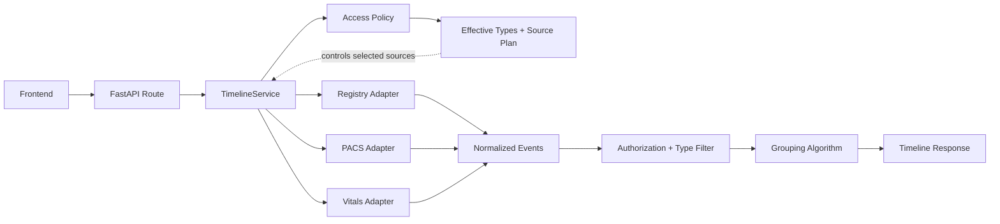

# Federated Patient Timeline API

Python FastAPI backend for the Sheba Cortex take-home assignment. It federates a patient timeline from PostgreSQL Registry, MongoDB PACS, and an HTTP Vitals service, then groups point-in-time events under overlapping parent intervals.

The original task specification is preserved in [ASSIGNMENT.md](ASSIGNMENT.md).

## Overview

This project implements the backend for a federated patient timeline, aggregating data from PostgreSQL Registry, MongoDB PACS, and an HTTP Vitals service into a unified API.

The backend is built with FastAPI and focuses on deterministic temporal grouping, source isolation, RBAC, concurrent federation, strict request validation, and graceful degradation when an upstream source is unavailable.

## Brief Summary

I implemented the timeline grouping as a deterministic sweep over chronologically sorted events, using a heap to track active parent intervals. Surgeries and emergency-room visits act as parent events, while vitals and imaging are point-in-time children. A child is assigned to the active parent that started most recently, using inclusive interval boundaries; if no eligible parent exists, it is returned as a standalone event. This avoids scanning every parent for every child while keeping the grouping logic isolated, deterministic, and easy to test.

For the overall design, I used FastAPI with a single `TimelineService` orchestrating three source-specific adapters for PostgreSQL Registry, MongoDB PACS, and the Vitals HTTP service. Relevant sources are selected before I/O based on RBAC and requested event types, then fetched concurrently and normalized into a shared event model. Expected source failures are isolated so healthy data can still be returned as HTTP 206, while unexpected defects remain safe 500 responses. I am most proud of keeping the solution relatively small while still covering the difficult parts of the assignment: temporal grouping, heterogeneous federation, authorization, and graceful degradation. With more time, I would add real authentication and patient-level authorization, a request-wide deadline strategy, stronger upstream identifiers for Vitals, workload-driven database and index tuning, and caching only where measurements justify it.

## Quick Start

**Prerequisites:** Docker and Docker Compose, Python 3.12 or newer.

From the repository root:

```bash
./start.sh
```

`./start.sh` does not delete database data. A new MongoDB volume is seeded once by Docker init. To wipe PACS imaging and restore the assignment seed later:

```bash
./reset.sh
```

| Service | URL |
| --- | --- |
| Frontend | [http://localhost:5173](http://localhost:5173) |
| Backend | [http://localhost:3000](http://localhost:3000) |
| API docs | [http://localhost:3000/docs](http://localhost:3000/docs) |

`Ctrl+C` stops the backend. Stop the Docker infrastructure with:

```bash
docker compose down
```

## Architecture



`TimelineService` owns orchestration. The access policy determines effective event types and which sources can contribute to the request, while adapters own source-specific schemas. Application code operates on normalized events, and grouping has no FastAPI, role, configuration, database, or HTTP dependencies.

## Features Implemented

- Federation across PostgreSQL Registry, MongoDB PACS, and HTTP Vitals
- Source-specific adapters that normalize data into typed timeline events
- Deterministic hierarchical grouping with inclusive interval boundaries and overlap resolution
- RBAC and requested-event-type filtering, including source minimization before I/O
- Concurrent source fetching with graceful HTTP 206 degradation when dependencies fail
- Strict request validation and OpenAPI documentation at `/docs`
- Structured privacy-conscious operational logging
- Optional parent pagination with `limit` and `offset`, implemented after grouping and sorting

## API

`GET /api/timeline`

| Parameter | Required | Description |
| --- | --- | --- |
| `patientId` | yes | Positive patient identifier |
| `X-User-Role` | yes | `doctor`, `nurse`, or `intern` |
| `from` | no | Inclusive ISO-8601 lower bound |
| `to` | no | Inclusive ISO-8601 upper bound |
| `types` | no | Comma-separated event types |
| `limit` | no | Maximum parent events after grouping, 1-100 |
| `offset` | no | Parent events to skip after grouping, >= 0 |

Unknown query parameters are rejected. Pagination applies only to sorted parents; standalone events are unchanged. Omitting `limit` and `offset` returns the full grouped result. The response shape is unchanged and does not add pagination metadata.

| Status | Meaning |
| --- | --- |
| 200 | All selected sources succeeded, or no source is required after filtering |
| 206 | One or more selected sources were unavailable |
| 400 | Validation error |
| 500 | Unexpected internal failure |

Example request:

```bash
curl -sS -H "X-User-Role: doctor" \
  "http://localhost:3000/api/timeline?patientId=1"
```

Example response shape:

```json
{
  "parents": [
    {
      "id": "registry:surgery:1",
      "type": "surgery",
      "children": [
        {
          "id": "vitals:vitals:1:2024-01-15T10:30:00Z",
          "type": "vitals"
        }
      ]
    }
  ],
  "standalone": [],
  "partial": false
}
```

Interactive API documentation, including request validation and response examples, is available at `/docs`.

## Grouping Algorithm

Parent events are surgeries and emergency-room intervals. Child events are vitals and imaging points. A parent is eligible when:

`parent.start <= child.timestamp <= parent.end`

Boundaries are inclusive. If multiple parents overlap, the parent with the latest start wins. If none match, the child becomes standalone. Parents are returned newest-first; children within each parent are chronological.

The implementation sorts parents by start and children by timestamp, then sweeps children while maintaining a heap of active parents ordered by latest start. Exact start and end matches stay inclusive because a parent is activated when `start <= timestamp` and dropped only when `end < timestamp`. When two eligible parents share the same start, the lower normalized parent ID wins. That tie-breaker is not defined by the assignment, so it is used only to keep results deterministic.

Example:

- Surgery: `10:00-12:00`
- Emergency Room: `11:00-13:00`
- Vitals: `11:30`

Both parents are active at `11:30`, so the Vitals event is assigned to the Emergency Room encounter because it started most recently.

After ordering inputs, heap assignment is `O((P + C) log P)`. For unsorted inputs, the end-to-end cost is `O(P log P + C log C + (P + C) log P)` with `O(P + C)` space.

## RBAC

| Role | surgery | emergency_room | imaging | vitals |
| --- | --- | --- | --- | --- |
| Doctor | yes | yes | yes | yes |
| Nurse | no | yes | yes | yes |
| Intern | yes | yes | no | yes |

Requested `types` are intersected with the role allowlist and can never expand permissions. Filtering happens before grouping, and only required sources are called. If an unauthorized parent is removed, an authorized child may become standalone or attach to another authorized parent.

## Resilience

Selected sources are fetched concurrently. Expected database, MongoDB, HTTP, timeout, and source-schema failures are isolated so healthy sources can still contribute events. A degraded result returns HTTP 206 with `partial=true` and a warning that names unavailable sources only. Unexpected defects return a safe HTTP 500 without raw exception text.

## Validation

- `patientId` must be a positive integer
- `X-User-Role` must be `doctor`, `nurse`, or `intern`
- `from` and `to` must be ISO-8601 strings; numeric epochs are rejected
- timezone-aware bounds are normalized to UTC; naive ISO timestamps are treated as UTC for this assignment
- `from` must be earlier than or equal to `to`
- `types` must be a comma-separated list of `surgery`, `emergency_room`, `vitals`, or `imaging`
- `limit` must be between 1 and 100; `offset` must be >= 0
- unknown query parameters return HTTP 400

## Edge Cases Handled

- Exact parent `start` and `end` boundaries are inclusive
- Multiple overlapping parents select the most recently started eligible parent
- Equal parent start times use a deterministic normalized-ID tie-breaker
- Children with no eligible parent are returned as `standalone`
- Authorized children remain visible when an unauthorized parent is removed by RBAC
- Relevant sources are skipped entirely when role/type filtering proves they cannot contribute
- One or more unavailable dependencies return successful-source data as HTTP 206
- Invalid dates, unknown event types, unknown query parameters, and invalid pagination return HTTP 400

## Testing

```bash
cd backend
pytest
TIMELINE_RUN_LIVE_TESTS=1 pytest
ruff check .
ruff format --check .
mypy
```

Live infrastructure is required only for the live pytest run. The seeded patient is `1`. With live infrastructure enabled, 154 tests currently pass.

## Key Technical Decisions

- **FastAPI** provides typed request/response models and OpenAPI at `/docs` without additional framework code.
- **asyncpg** is used directly for the small, fixed Registry query surface instead of introducing ORM mapping overhead.
- **PyMongo Async** reads PACS imaging documents through a lifespan-managed asynchronous client.
- **HTTPX** reuses one asynchronous client for the Vitals mock; because the mock has no date query parameters, inclusive date filtering is applied in the adapter.
- **Adapter boundaries** keep SQL rows, Mongo documents, and HTTP payloads out of application code.
- **One `TimelineService`** owns policy application, source selection, concurrent federation, and response construction without adding extra orchestration layers.
- **Concurrent source fetches** use `asyncio.gather` so independent source latency overlaps.
- **Pure grouping** keeps the scoring-critical algorithm isolated and testable without FastAPI, configuration, or I/O.

## Assumptions and Requirement Ambiguities

1. **Standalone contradiction.** The response example comments that `standalone` is always empty, while the grouping algorithm explicitly says unmatched children become standalone. The implementation follows the grouping algorithm because grouping correctness is identified as the core challenge.
2. **Naive ISO timestamps.** Naive ISO-8601 request bounds and supplied-source timestamps are interpreted as UTC.
3. **Vitals IDs.** The mock Vitals payload has no identifier, so IDs are `vitals:vitals:<patient-id>:<normalized-UTC-timestamp>`, assuming at most one reading per patient and timestamp.
4. **Frontend standalone display.** The supplied frontend does not render `standalone` events. Frontend UI and business logic were intentionally left unchanged because the assignment permits only a backend URL/proxy adjustment.

## Known Limitations / Production Follow-ups

These are production follow-ups, not missing assignment functionality:

- real authentication and patient-level authorization
- a request-wide remaining-budget deadline
- a durable upstream Vitals identifier
- workload-driven database and index tuning
- caching only where measurements show a useful benefit
- retries or circuit breakers only if production dependency behavior warrants them

## UX Improvements I Would Propose

The supplied frontend was intentionally left unchanged beyond backend connectivity. The assignment prohibits modifying frontend UI or business logic, so the items below are theoretical product/UX proposals for discussion, not implemented features.

### 1. Render standalone events

The backend returns child events with no eligible parent in `standalone`. The supplied frontend currently does not render that array, so a vitals-only response can contain valid data while the UI appears empty. I would surface standalone events directly in the timeline or in a dedicated section.

### 2. Add event-type filters

The backend already supports the `types` query parameter: `surgery`, `emergency_room`, `vitals`, and `imaging`. The frontend does not expose this capability. Simple event-type filter controls would let clinicians focus the timeline without requiring a new API.

### 3. Make partial-data states more contextual

The supplied frontend already surfaces a partial-data state. I would make it more contextual by showing unavailable source names directly near the affected timeline content, making the distinction between "no data" and "temporarily unavailable data" clearer.

### 4. Improve timeline hierarchy and scanability

Parent encounters and child events could use a clearer visual hierarchy, with source indicators, child counts, and optionally collapsible encounters. This would improve scanability without requiring a full redesign.

### 5. Improve loading and refresh feedback

The timeline is federated from multiple independent sources whose response times may differ. A clearer loading and refresh state, and optionally source freshness where clinically appropriate, would make that wait more understandable.

## AI Usage

AI tools were used for implementation assistance, design exploration, test generation and review, and code review. Architecture decisions, scope, validation, review, and final acceptance were evaluated manually.

## Assignment

The original provided task specification is preserved in [ASSIGNMENT.md](ASSIGNMENT.md).
